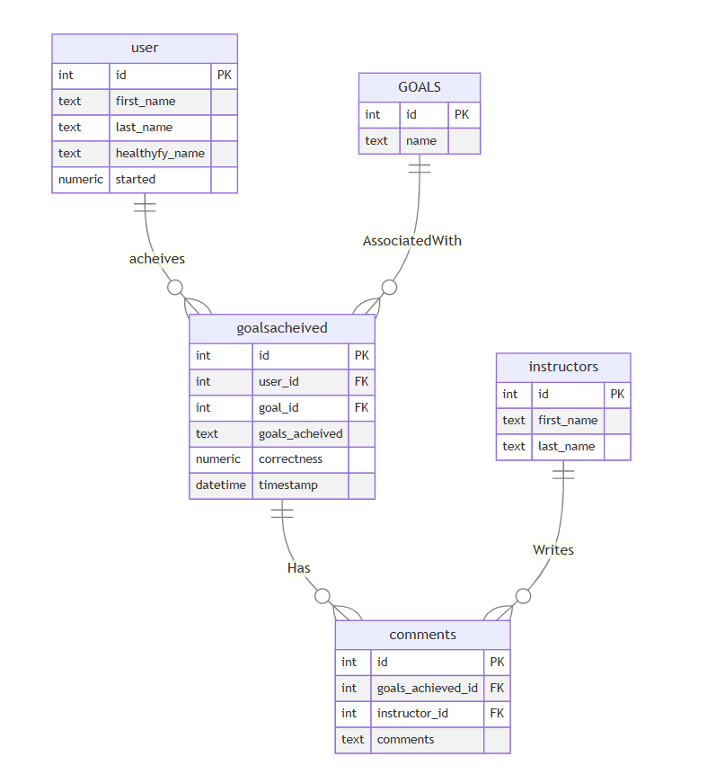

# Design Document

By Dhanush Gowda

Video overview: (https://youtu.be/K597olUFtHw)

## Scope

The pupose of the database is to make easy to track the physical goals of every individual on this planet who can assign or
get assigned a physical goals as per their need and keep a instructor who can guide them to acheive their goals by monitoring
their progress and give them feedbacks. As such, included in the database's scope is:

* Users, including basic identifying information
* Instructors, including basic identifying information
* User acheivement with the time at which user acheived the goal with the correctness score and the goal name to which the goal was
 acheived.
* goals, with the simple explanation to acheive it
* Comments from the instructor for the particular goals and the time at which goals were acheived.

Out of scope elements include certificates, appreceiations, rewards and other attributes.

## Functional Requirements

In this section you should answer the following questions:
This database will support:

* CRUD operations for users and instructors.
* Tracking all versions of the goals acheived by the user for a goal, the goals can be acheive multiple times based on user
 preferences.
* A Instructor can comment multiple times for a users acheivement.

In this scope a user cannot respond to the instructors comments to their acheivements/ feedbacks.

## Representation

Entities are captured in the SQLite tables with the following schema.

### Entities

The database includes the folowing mentioned entities.

### USERS

The `users` table includes:

* The `id` which specifies the unique ID for the users as `INTEGER`. So this column is mentioned as the `PRIMARY KEY`
 constraint.
* `first_name` which specifies the users first name as `TEXT`, given `TEXT` is appropriate for the name fields.
* `last_name` which specifies the users last name. `TEXT` is for the same reason as used for the `first name`.
* `healthyfy_name` which specifies the users healthfy app name.`TEXT` is used as the same reason as used for the `first_name`.
   A `UNIQUE` constraint is used to make the name unique which helps to identify the record easily and make the user choose
   his name as per his creative needs. It make sures that no two users have the same name.
* `started` which specifies the date and time at which the user has started his healthyfy journey. Timestamps in SQLite can be
   conveniently stored as `NUMERIC`, per SQLite documentation at <https://www.sqlite.org/datatype3.html>. The default value
   for the `started` attribute is the current timestamp, as denoted by `DEFAULT CURRENT_TIMESTAMP`.

All columns in the `users` table are required so they have the `NOT NULL` constraint applied. No other constraints are
necessary.

### INSTRUCTORS

* The `id` which specifies the unique ID for the instructors as `INTEGER`. So this column is mentioned as the `PRIMARY KEY`
 constraint.
* `first_name` which specifies the instructors first name as `TEXT`, given `TEXT` is appropriate for the name fields.
* `last_name` which specifies the instructors last name. `TEXT` is for the same reason as used for the `first name`.

All columns in the `instructors` table are required so they have the `NOT NULL` constraint applied. No other constraints are
 necessary.

### GOALS

* The `id` which specifies the unique ID for the goals as `INTEGER`. So this column is mentioned as the `PRIMARY KEY`
constraint.
* `name` which specifies the goals needed/wanted to be acheived as `TEXT`, `TEXT` is appropriate in this case as the goals can
be clearly mentioned/explained to make sure it is understood it precisely

All columns in the `goals` table are required so they have the `NOT NULL` constraint applied. No other constraints are
 necessary.

### GOALS ACHEIVED

* The `id` which specifies the unique ID for the goals as `INTEGER`. So this column is mentioned as the `PRIMARY KEY`
 constraint.
* `user_id` which specifes the id of the user who has acheived the goal as an `INTEGER`.This column thus has the `FOREIGN KEY`
 constraint applied, referencing the `id` column in the `users` table to ensure data integrity.
* `goal_id`, which specifies the id of the goal to be acheived as an `INTEGER`. This column thus has the `FOREIGN KEY`
 constraint applied, referencing the `id` column in the `goals` table to ensure data integrity.
* `goals_acheived`, which specifies the goal acheived by a user in a manner, here the user describes the work done by him to
 acheive the goal as per his knowledge and dedication/discipline to acheive the goal, it is of type affinity `TEXT`.
* `correctness`, which is the score, as numeric, the user received on the goal_acheivement. This column is represented with
 a `NUMERIC` type affinity.
* `timestamp`, which is the timestamp at which the goal was acheived.

All columns are required and hence have the `NOT NULL` constraint applied where a `PRIMARY KEY` or `FOREIGN KEY` constraint
is not. The `correctness` column has an additional constraint to check if its value is either 0 or 1, given that this is the
value to know is the person has acheived the goal as required or not. Similar to the users `started` attribute, the
goal_acheived `timestamp` attribute defaults to the current timestamp when a new row is inserted.

`ON DELETE CASCADE` constraint is applied to the `FOREIGN KEY` in the `user_id` column as to when a user decides to leave the
 app it helps to delete his record in this particular table from his id.

`ON DELETE CASCADE` constraint is applied to the `FOREIGN KEY` in the `goal_id` column as to when a user or instructor  decides
 to delete a goal when it is completed/acheived it helps to delete records of the goals acheived for the particular goal.

### COMMENTS

The `comments` table includes:

* `id`, which specifies the unique ID for the submission as an `INTEGER`. This column thus has the `PRIMARY KEY` constraint
  applied.
* `instructor_id`, which specifies the ID of the instructor who wrote the comment as an `INTEGER`. This column thus has the
  `FOREIGN KEY` constraint applied, referencing the `id` column in the `instructors` table, which ensures that each comment be
  referenced back to an instructor.
* `goals_acheived_id`, which specifies the ID of the goals_acheived on which the comment was written as an `INTEGER`. This column
 thus has the `FOREIGN KEY` constraint applied, referencing the `id` column in the `goals_acheived` table, which ensures each
 comment belongs to a particular submission.
* `comments`, which contains the contents of the columns as `TEXT`, given that `TEXT` can still store long-form text.

All columns are required and hence have the `NOT NULL` constraint applied where a `PRIMARY KEY` or `FOREIGN KEY` constraint is not.

`ON DELETE CASCADE` constraint is applied to the `FOREIGN KEY` in the `instructor_id` column as to when a instructor decides to leave the app it helps to delete his record in this particular table from his id.

`ON DELETE CASCADE` constraint is applied to the `FOREIGN KEY` in the `goals_acheieved_id` column as to when a user or instructor  decides to leave the app it deletes his records associated with his id.

### Relationships

The below entity relationship diagram describes the relationships among the entities in the database.

As detailed by the diagram:

* One user is capable of making 0 to many acheivements. 0, if they have yet to acheive the goal, and many if they acheive more than one goals (or make more than one acheivements to any one goal). A acheivement is made by one and only one user. It is assumed that users will acheive goal individually(not group work).
* A acheivement is associated with one and only one goal. At the same time, a goal can have 0 to many acheivements: 0 if no users have acheived goal for a particular goal, and many if more than one user has acheived for that one goal.
* A comment is associated with one and only one acheivement, whereas a acheivement can have 0 to many comments: 0 if an instructor has yet to comment on the acheivement, and many if an instructor leaves more than one comment on a acheivement.
* A comment is written by one and only one instructor. At the same time, an instructor can write 0 to many comments: 0 if they have yet to comment on any users' acheivement, and many if they have written more than 1 comment.

## Optimizations

Per the typical queries in `queries.sql`, it is common for users of the database to access all goals acheived
by any particular user. For that reason, indexes are created on the `first_name`,`last_name`and
`healthyfy_name` columns to speed the identification of students by those columns.

Similarly, it is also common practice for a user of the database to concerned with viewing all users who acheived their goals. As such, an index is created on the `name` column in the `goals` table to speed the identification of goals by name.

It is also common that a instructor may change the comments written previously for a user seeing his progress and to motivate him at the same time so an index is created on the `goals_acheived_id` column of the `comments` table to speed up the identification of the comments by goals_acheived_id.

When a user decides to end is journey from the healthyfy app he may decide to leave the app and decides to delete his all the records of all tables from  using his id so an index is created on the `id` column of the `users` table and an index on the `user_id` column of the `goals_acheived` table, to speed up the identification of the user accorss tables

## Limitations

 The current schema assumes individual acheivement. Collaborative acheivement would require a shift to a many-to-many relationship between users and goals acheived.

If a user or instructor decides to delete his data from the app it deletes all the records assciated with either of them.

User cannot comment back on the instructors feedback.
